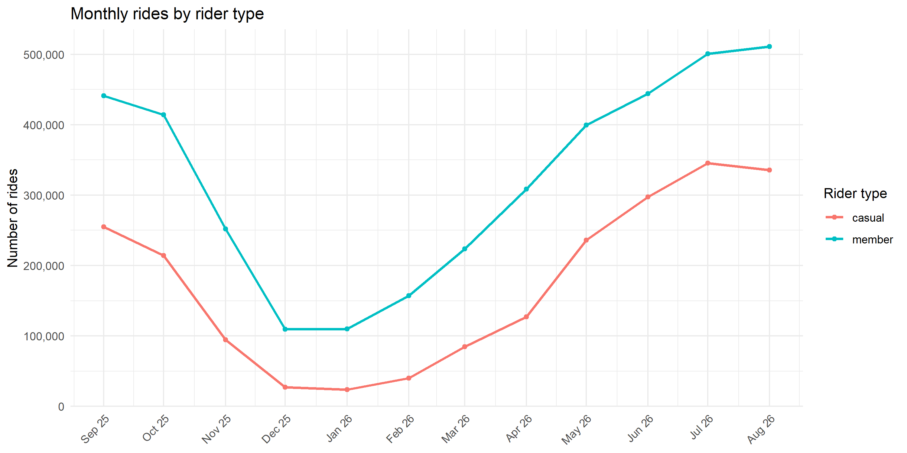
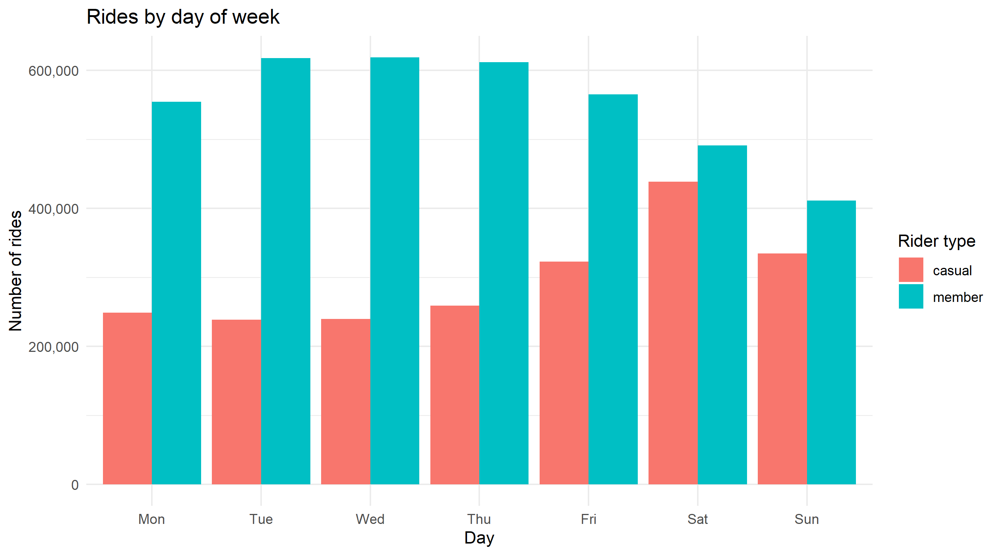
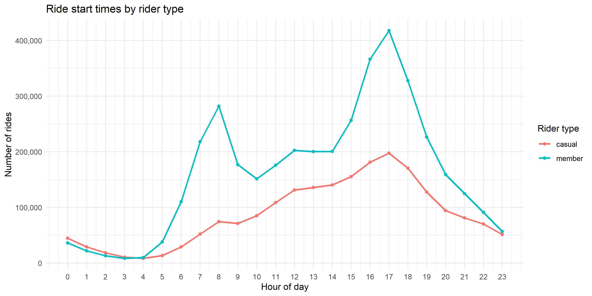
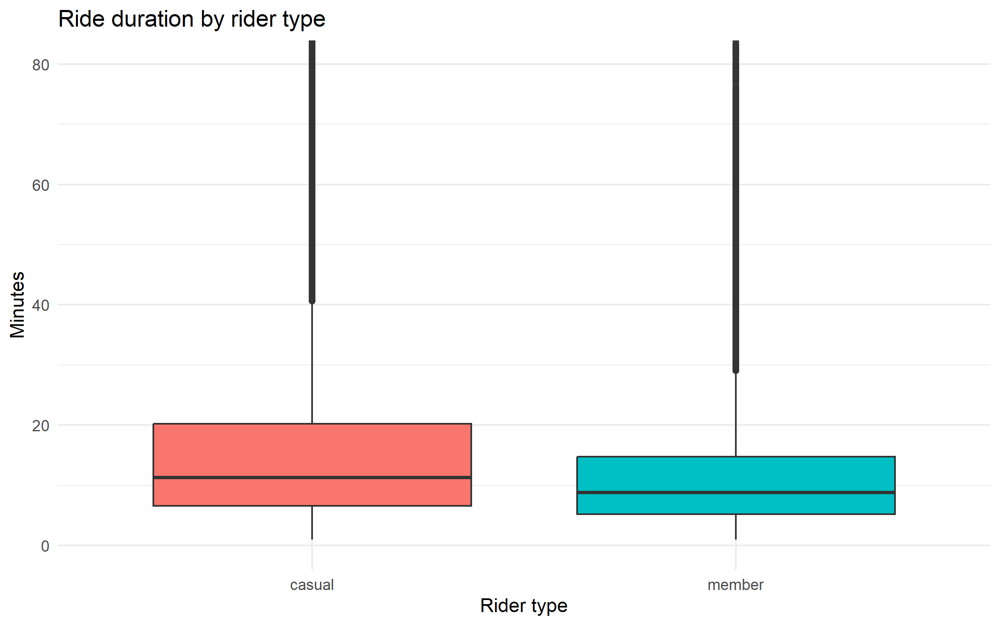

# Cyclistic Bike-Share Case Study: How Do Members and Casual Riders Use Bikes Differently?
 
**Tools:** R (tidyverse, lubridate, ggplot2) · **Data:** 5.95 million rides, September 2025 to August 2026
 
A capstone case study (Google Data Analytics Certificate, Case Study 1) following the **Ask, Prepare, Process, Analyze, Share, Act** framework. I play a junior analyst on the marketing team of Cyclistic, a fictional Chicago bike-share company, using real public trip data from Divvy.
 
## Summary
 
Annual members ride like commuters: steady through the week and the year, with rush-hour peaks. Casual riders ride like leisure users: weekends, afternoons, summer, and lakefront tourist stations. About 81% of casual rides happen from May to October, so that is when a conversion campaign has the most riders to reach.
 
---
 
## 1. Ask: Business task
 
**Business task:** Identify how annual members and casual riders use Cyclistic bikes differently, so the marketing team can design a strategy to convert casual riders into annual members.
 
- **Stakeholders:** Lily Moreno (Director of Marketing), the marketing analytics team, and the executive team, who must approve any recommendation.
- **Why it matters:** Cyclistic's finance team found annual members are more profitable than casual riders. Casual riders already know the service, so converting them is likely cheaper than acquiring new customers.
- **Scope:** This analysis answers the first of three guiding questions (*How do annual members and casual riders use Cyclistic bikes differently?*). The other two (why casual riders would buy memberships, and how digital media could influence them) need data beyond trip records.
## 2. Prepare: Data sources
 
| Item | Detail |
|---|---|
| Source | Divvy public trip data, published by Motivate International Inc. ([data index](https://divvy-tripdata.s3.amazonaws.com/index.html)) |
| Period | September 2025 to August 2026 (12 monthly CSV files) |
| Size | 6,115,982 raw rows, 13 columns |
| Key fields | `ride_id`, `rideable_type`, `started_at`, `ended_at`, start/end station name and ID, start/end latitude and longitude, `member_casual` |
| Storage | Raw files kept unmodified in a local `data/` folder, not committed to GitHub because of size and licensing. See [`data/README.md`](data/README.MD) for how to download them. |
| License | Used under the Divvy data license agreement. Check the current terms at the Divvy website before reuse. |
| Privacy | Trip records contain no personally identifiable information. This also means pass purchases can't be linked to individuals, so I can't tell whether casual riders live in Chicago or buy multiple passes. |
 
**Does the data ROCCC?**
 
- **Reliable:** Records come from the operator's own geotracked system. About 21% of start stations and 22% of end stations are blank, which limits any station-level conclusion.
- **Original:** Primary data published by the operator, though it is a stand-in for the fictional company.
- **Comprehensive:** Covers every logged ride for the period. It has no rider demographics, pricing, trip purpose, or weather.
- **Current:** Covers the most recent 12 months.
- **Cited:** Source and license named above.
**Limitations:** Trip data shows *what* riders do, not *why*. Rider types are labeled by pass type only.
 
## 3. Process: Cleaning and documentation
 
**Why R:** A year of data is about 6 million rows, which exceeds the 1,048,576-row limit of a spreadsheet sheet. R also makes the whole workflow reproducible in one script ([`cyclistic_analysis.R`](cyclistic_analysis.R)).
 
**Steps**
 
1. Read all 12 CSVs as text so column types can't clash, then stacked them.
2. Parsed `started_at` and `ended_at` into date-times (0 unparseable).
3. Standardized `member_casual` to lowercase `member` / `casual`.
4. Created `ride_length_minutes`, `day_of_week` (Mon to Sun), `start_hour`, `is_weekend`, and `year_month`.
5. Removed rows that couldn't be analyzed reliably:
   - missing `ride_id`, timestamps, or rider type
   - rides under 1 minute (likely false starts or re-docks)
   - rides over 24 hours (likely unreturned or lost bikes)
   - rides outside the 1 Sep 2025 to 31 Aug 2026 window
   - duplicate `ride_id` values (35 found)
6. Wrote a validation report to `cyclistic_outputs/validation_report.csv`.
**Results**
 
| Metric | Value |
|---|---|
| Raw rows | 6,115,982 |
| Clean rows | 5,951,516 |
| Rows removed | 164,466 (2.7%) |
| Duplicate ride IDs | 35 |
| Unparseable timestamps | 0 |
| Missing start / end station names | 1,285,406 / 1,349,937 (21% / 22% of raw rows) |
| Ride length range | 1 to about 1,440 minutes |
 
Missing station names were **kept** in the ride-level analysis and excluded only from the station ranking. The data doesn't say why they are blank, so I make no claim about the cause.
 
## 4. Analyze: Summary of analysis
 
| | Members | Casual riders |
|---|---|---|
| Rides | 3,870,680 (65%) | 2,080,836 (35%) |
| Average ride | 12.2 min | 18.4 min |
| Median ride | 8.7 min | 11.2 min |
| Share of rides on weekends | 23% | 37% |
| Electric bike share | 67% | 73% |
 
- **Ride length:** Casual riders ride about 50% longer on average, but the median gap is smaller, so a minority of long rides pulls their average up.
- **Day of week:** Members ride most Tuesday to Thursday (about 16% of their rides each day). Casual riders ride most on Saturday (21%) and Sunday (16%).
- **Time of day:** Both groups peak at 5pm. Members also have a strong morning peak at 7 to 8am (13% of their rides vs 6% for casual riders). Casual riders have more midday rides and more late-night rides (about 10% start between 10pm and 2am vs 6% for members).
- **Season:** Casual rides peak in July (about 346k) and fall to about 24k in January, a swing of roughly 14x. Members swing about 5x (about 511k in August to about 109k in December). Casual riders are about 40% of rides in June to August but only about 18 to 20% in December and January. About 81% of all casual rides fall in May to October.
- **Stations (rides with a station name):** The top casual start stations are lakefront attractions (Navy Pier, DuSable Lake Shore Dr & Monroe St, Michigan Ave & Oak St, Millennium Park, Shedd Aquarium). The top member start stations are in the Loop and West Loop (Canal St, Clinton St, Wells St, State St).
## 5. Share: Visualizations and key findings
 

 
**Key findings**
 
1. Members behave like **commuters**: weekday-heavy, with morning and evening peaks and stations near offices and transit.
2. Casual riders behave like **leisure users**: weekend-heavy, longer rides, and lakefront tourist stations.
3. The two groups overlap at the 5pm peak, so some casual riders may already use the bikes for everyday trips. The data can't show how many.
4. Casual riding is **highly seasonal** and concentrated in May to October.
**Reading the results carefully:** These are patterns in the data, not proven motives. The data doesn't show who casual riders are (tourists or locals) or why they ride.
 
## 6. Act: Top three recommendations
 
1. **Reach casual riders where they ride.** Put membership prompts (dock signage, QR codes, in-app messages) at the lakefront stations casual riders favor, such as Navy Pier, Lake Shore Dr, and Millennium Park.
2. **Time campaigns to the season and the week.** Concentrate digital media from May to October, with pushes from Thursday to Saturday. Reduce spending in winter, when casual ridership nearly disappears.
3. **Make the value of membership concrete.** Show casual riders what they would have saved with a membership, using actual pricing (not in this dataset). Consider credit toward a membership after several casual rides, and aim part of the message at riders who already ride around 5pm with an everyday-use pitch.
These are hypotheses to test, such as a pilot at a few stations, not proven interventions.
 
**Next steps and additional data**
 
- Pricing and revenue data, to size the savings message and compare lifetime value.
- Rider surveys, to learn *why* casual riders ride and what would persuade them (the second guiding question).
- Weather data, to separate seasonality from temperature effects.
- Results of the pilot, to measure whether prompts actually convert riders.
---
 
## Reproduce this analysis
 
1. Download the 12 monthly files into `data/` (see [`data/README.md`](data/README.md)).
2. Open R or RStudio in the repository root and run `source("cyclistic_analysis.R")`.
3. Outputs (CSV summaries, validation report, PNG charts) are written to `cyclistic_outputs/`.

 
> ## Attribution
 > Trip data © Motivate International Inc., used under the Divvy data license. "Cyclistic" is a fictional company created for the Google Data Analytics Certificate case study.

